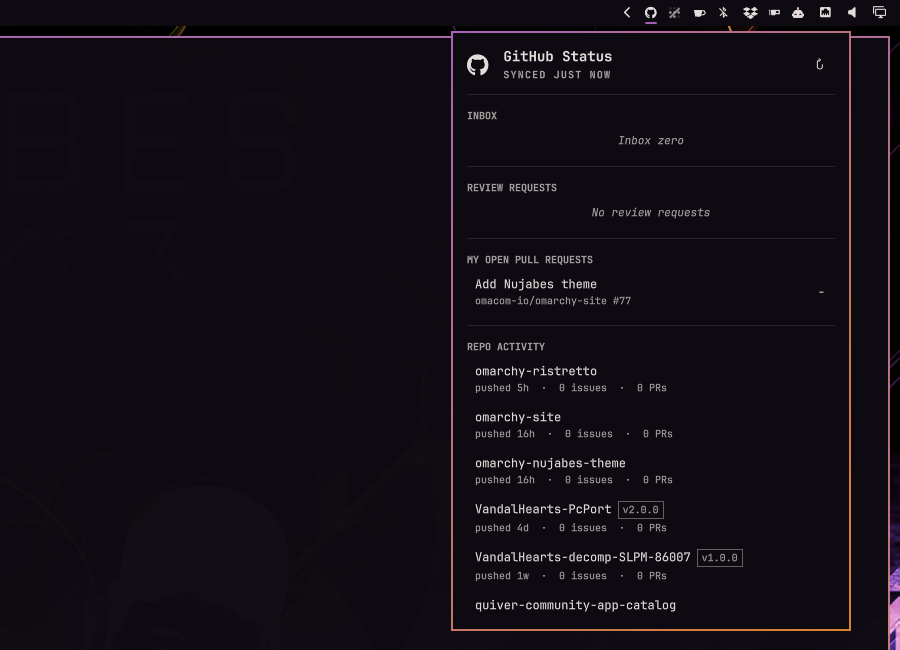

# GitHub Status

Not a notification inbox — a status-bar dashboard for a solo maintainer's own
repos: activity, own open PRs with CI/review state, review requests,
alongside notifications.



From the bar you can see, at a glance and in one click:

- Unread GitHub notifications — count in the bar, list in the panel.
- Your own open PRs, with CI status and review decision.
- PRs waiting on your review.
- Open issues you yourself authored, across every repo — with a
  **Subscribed** toggle so unsubscribed clutter stays out of your way by
  default.
- Activity across your own repos: latest commit, open issues/PRs, latest
  release, most-recently-pushed first, with an archived/fork/private status
  pill.
- A live search field at the top of the panel filters every section as you
  type, temporarily expanding sections with matches and restoring your fold
  layout when cleared.
- Hover a PR or issue row to see who commented last and when.
- Every section opens folded; click its header to expand or collapse it.
- Click any item to open it on github.com in your browser and close the popup.

## Features

- **Bar glyph + count pill** for unread notifications, recoloring when any of
  your own open PRs has failing CI or you have a pending review request.
- **Inbox** — unread notifications with repo, title, reason, and relative
  reception age.
- **Review requests** — PRs waiting on you, shown ahead of your own PRs
  because someone else is blocked on you.
- **My open PRs** — title, repo, draft flag, CI rollup, review decision, and
  relative last-activity age, across every repo you can access, not just one
  repo at a time (a section pill reads "N of T" if you have more open than
  the section's own display window).
- **My open issues** — issues you yourself opened and are still open, across
  every repo, with a relative last-activity age. A **Subscribed** toggle
  chip in the section header (active by default) hides issues you've
  unsubscribed from, so old clutter you no longer care about doesn't linger
  in the panel — toggle it off to see every open issue again (same "N of T"
  pill behaviour as My open PRs above).
- **Repositories** — your own repos with open issue/PR counts and the latest
  release tag where one exists, most-recently-pushed first.
- **Search** — a live filter field at the top of the panel. Type anything
  and every section (notifications, PRs, review requests, issues, repos)
  narrows to matching title/repo/owner/name in place; count pills reflect
  what's actually shown while you search. Matching sections temporarily
  expand while zero-match sections stay folded; clearing the query restores
  the layout you had before searching. Esc clears the query first, then
  closes the panel on a second press; a clear (✕) button is always available
  too.
- **Last commenter on hover** — hover a PR, review-request, or issue row to
  see who commented last and how long ago, when there's a comment to show.
- **Folded sections** — every panel session starts with all sections folded.
  Click any section header, including an empty or still-loading one, to
  expand or collapse it; its chevron shows the current state. All sections
  return to folded when the panel reopens.
- **Status pills everywhere** — every section header carries a right-aligned
  count pill (unread count for Inbox, rendered/filtered-list length
  elsewhere), and a section with nothing in it folds to just that header
  row — no empty-state filler text. Repo rows get an archived/fork/private
  pill (archived wins when more than one applies); PR/issue/inbox rows for a
  repo you don't own get a small pill naming the external owner.
- **Graceful degradation** — if `gh` isn't installed, isn't signed in, the
  network is down, you're rate-limited, or GitHub itself answers with an
  error, the panel says so plainly and keeps showing your last-known-good
  data instead of going blank. A GitHub-side error is reported as a GitHub
  API error with the HTTP status when known, distinct from being offline;
  the bar icon shows a small status dot for any of these status states.

## Requirements

This plugin never touches a credential of its own. Every GitHub call goes
through the GitHub CLI (`gh`), using whichever account you've already
authenticated it with — the plugin reads and displays only what `gh` is
already allowed to see. Install and sign in to the GitHub CLI first; see
[cli.github.com](https://cli.github.com/) for instructions for your system,
then run its sign-in flow once from a terminal. If `gh` is missing or not
signed in, the bar tells you so instead of failing silently.

Omarchy 4.0.1 or later (including the scoped plugin API introduced in
4.0.3).

## Install

```bash
omarchy plugin add https://github.com/HalmyLyseas/omarchy-github-status
```

The plugin installs disabled so you can review the code first. Enable it
from Omarchy's plugin settings, or:

```bash
omarchy plugin enable halmylyseas.github-status
```

The GitHub glyph appears in the bar's right section.

## Usage

Click the bar icon to open the panel. It refreshes automatically in the
background; the hero row also has a manual refresh button for "check right
now." Sections start folded; click a header to inspect its rows. Click any
notification, PR, review request, issue, or repo row to open it on github.com
in your default browser; the popup then closes.

## Settings

Available from Omarchy's own bar-widget settings form (no in-panel settings
UI in this version):

| Setting | Default | Range | Meaning |
|---|---|---|---|
| Dashboard refresh interval | 180s | 60–3600s | How often PRs, review requests, and repositories refresh. |
| Notifications poll interval | 60s | 60–600s | How often the notifications inbox polls. Matches GitHub's own guidance; conditional requests mean an unchanged inbox costs nothing. |
| Repos shown in repositories list | 10 | 3–30 | How many of your repos appear in the Repositories section, most-recently-pushed first. |
| Subscribed only | Focus | Focus / All | Whether My open issues shows only issues you're still subscribed to (Focus) or every open issue you authored (All) — also toggleable from the panel's **Subscribed** chip in the My open issues section header. |

A changed value is picked up within a few seconds, no shell restart needed;
a changed poll interval starts a fresh countdown immediately — no shell
restart, no extra request.

## API usage

At default settings, here's what the plugin costs against your GitHub rate
limits:

| Poll | Default interval | Steady-state cost |
|---|---|---|
| Notifications (REST) | 60s | ~60 requests/hr, but an unchanged inbox returns HTTP 304 via conditional (ETag) requests, which cost **nothing** — typically ~1 counted request/hr in practice |
| Dashboard (GraphQL: PRs, review requests, issues, repos) | 180s | ~20 calls/hr, ~1 point each — ~20 points/hr |

GitHub gives every authenticated user, free plans included, 5000 REST
`core` requests/hour and 5000 GraphQL points/hour — separate budgets. At
these defaults the plugin uses well under 1–2% of either one per hour, so
there's plenty of headroom even on a free account; the panel's manual
refresh button adds one extra dashboard call per click, and raising either
interval in Settings lowers usage further. The plugin never calls GitHub's
REST search API, so its much tighter separate 30-requests-per-minute budget
is never touched.

## Security & privacy

- **The plugin never sees a credential.** All GitHub access goes through
  your own `gh` CLI session; the plugin never reads, logs, or stores a
  token, and never runs any `gh auth` command that could change or expose
  one.
- **Read-only.** Every GitHub call is a `gh api` GET or a GraphQL `query` —
  never a mutation. This plugin cannot star, comment, merge, close, or
  change anything on your behalf.
- **No disk cache of GitHub data.** Every notification/PR/issue/repo list
  lives in memory only, for the life of the shell session, and is refetched
  from scratch on the next restart. Your settings (refresh intervals, repo
  limit, issues filter) are persisted through Omarchy's own shell config —
  the same mechanism every other bar widget's settings use — not a cache
  this plugin manages itself.
- **Only github.com opens.** Every clickable item is checked against a
  strict `https://github.com/` prefix before your browser is asked to open
  it, and that open never goes through a shell — no other host or scheme is
  ever launched.

## Removal

```bash
omarchy plugin remove halmylyseas.github-status
```

This disables the plugin and deletes its folder. Any settings you changed
were stored in Omarchy's own shell config and are removed along with the
plugin's entry; no GitHub data was ever cached to disk in the first place,
so removal just stops the bar glyph and its background polling.

## Verify

```bash
bash test/all
omarchy plugin validate .
```

`test/all` runs the Node unit tests (`Model.js`, a QML `Text` PlainText-sink
audit, the comment-hygiene scan), two read-only contract tests (a version
pin against your real installed `gh` CLI, and a check that the installed
Omarchy plugin facade still exposes what this plugin depends on — both
skip cleanly when the thing they check isn't present), then three
`qs -n -p` probe suites: one drives the real `Service.qml` through its full
status ladder against a mock `gh`, one drives the real `BarWidget.qml`/
`Panel.qml` against a stub shell/bar, and one drives the settings path
against the real installed plugin facade and an isolated `shell.json`. A
GitHub Actions workflow (`.github/workflows/test.yml`) runs the same checks
headlessly on every push/PR; `test/ci-local [--no-cage]` mirrors it on a
dev box. See [`docs/developers.md`](docs/developers.md) "Testing"/"CI" for
what each suite proves.

## License

[MIT](LICENSE)
